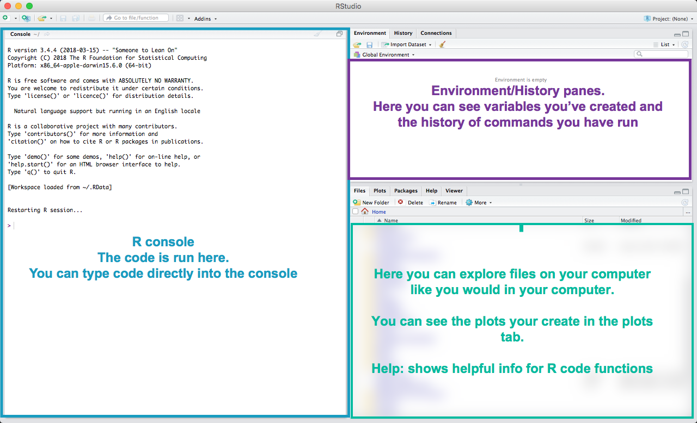
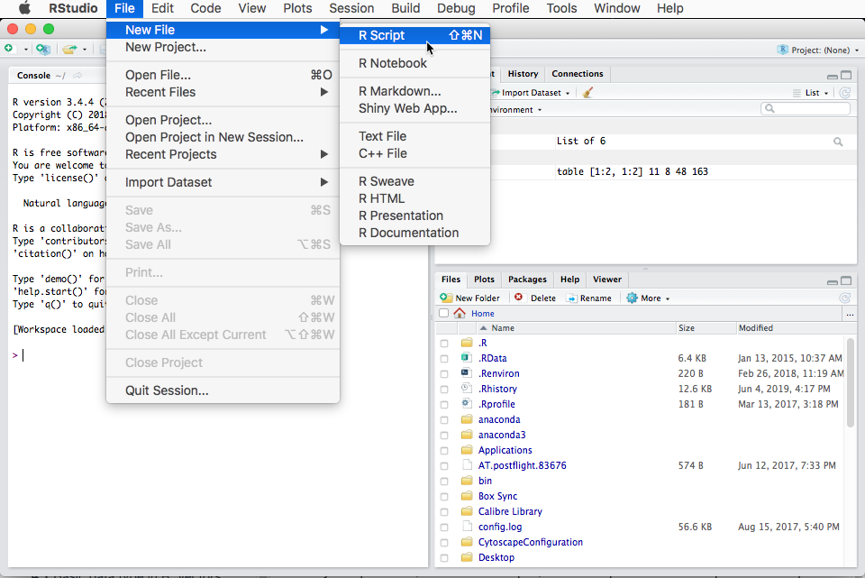
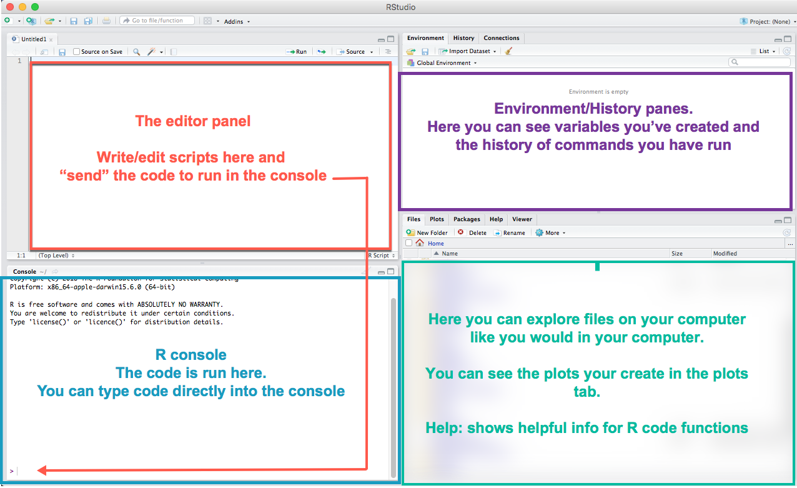
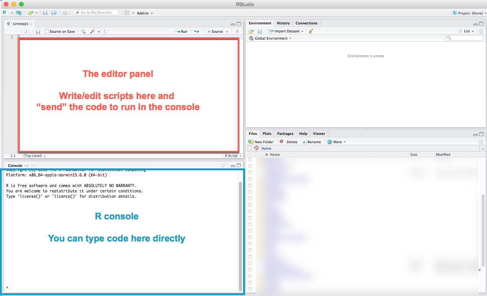
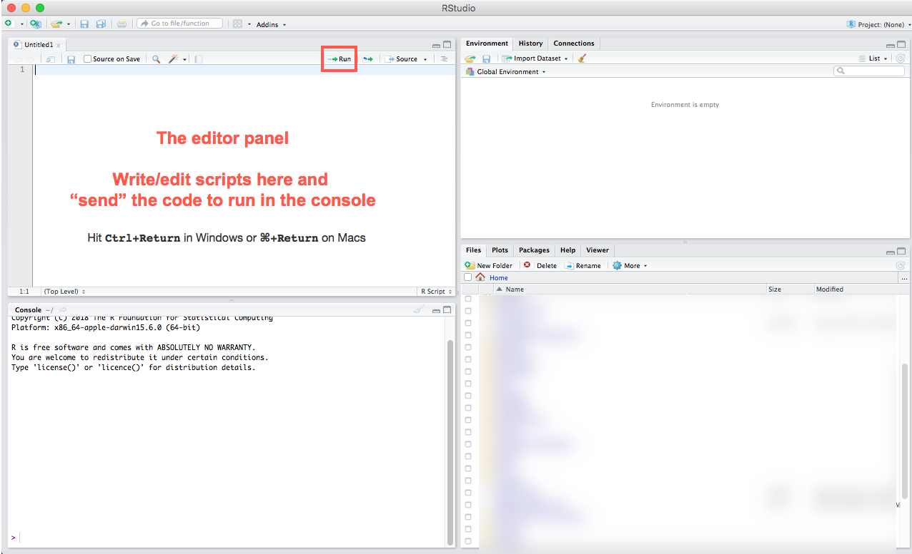
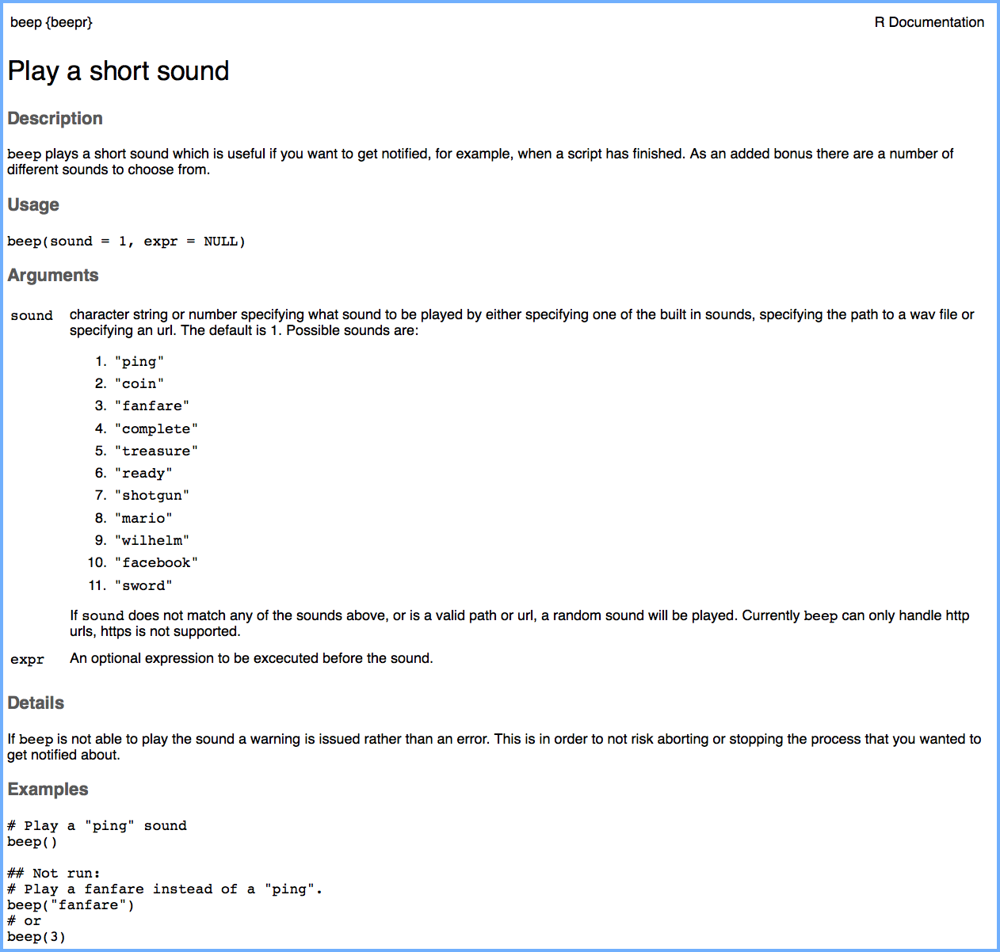
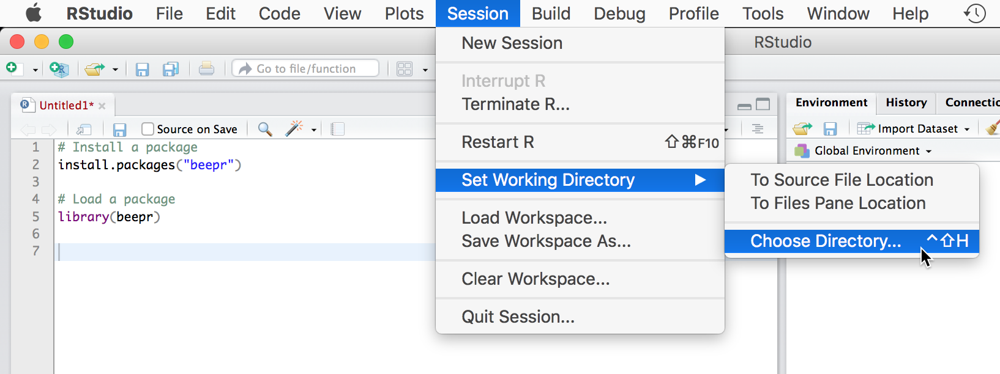

# Introduction to R & RStudio

#### Learning Objectives {-}
By the end of this lesson, you will:

* Know what R is and what some of its uses can be
* Be familiar with the four main panels in RStudio
* Know how to interact with R
* Be able to install a package in R
* Be able to manage your R environment

## What is R and why use it {-}

#### Slides {-}

```{r intro-slides, echo = FALSE}
# knitr::include_url("https://nistara.github.io/predict-conf_slides/slides/intro-r/intro-r.html")
knitr::include_url("extras/lessons/intro-r.pdf")
```

[Link to online presentation](https://nistara.github.io/predict-conf_slides/slides/intro-r/intro-r.html)

<br><br><br>

## Introduction to RStudio {-}

RStudio is a free, open source R integrated development environment, i.e., it makes it easier for us to work with R. It provides a built in editor, works on all platforms (Windows, Mac and Linux) and provides many advantages such as integration with project management.


When you first open RStudio, you will be greeted by three panels:

  * The interactive R console (entire left)
  * Environment/History (tabbed in upper right)
  * Files/Plots/Packages/Help/Viewer (tabbed in lower right)

#### RStudio when you first open it {-}
```{r rstudio1, echo = FALSE}

```


To open a new R script (i.e. an R file), go to File -> New File -> R Script

```{r rstudio3, echo = FALSE}

```
<br>

#### RStudio with an open R file/script {-}
Once you open files, such as R scripts, an editor panel will also open
in the top left.

```{r rstudio2, echo = FALSE}

```
<br>


## Interact with R {-}

When we work with R, we are writing down instructions for the computer to follow.
We call these instructions commands, and the process of telling a computer to start
following our commands is called execution, or running the command. 

Hence, remember:

**COMMANDS**: the “instructions” that we tell the computer to follow.

**EXECUTE/RUN**: When we execute a command, we are telling the computer to carry it out.


## Two main ways you can program within RStudio {-}

**Type commands directly in the R console and press `enter`**. The results are 
displayed immediately under the command. Your code is lost once you close your
R session though. 

OR

**Start writing in an .R file (the R script file) and use RStudio's short 
cut keys for running the command**, i.e. sending it to the interactive console.
    - This is a great way to work because all your code is saved for later use 
	as well.

<br>

```{r run-code, echo = FALSE}

```

<br>

## Running your commands/code from the R script file {-}

To run the current line, you can  
Click on the `Run` button above the editor panel

OR

Hit **<kbd>Ctrl</kbd>+<kbd>Return</kbd>** in Windows or **<kbd>&#8984;</kbd>+<kbd>Return</kbd>** on Macs. 

To run a block of code, select it and then run as above. 

The R console shows a blinking `>` prompt when it is ready to accept commands. When you `run` a command, R will try to execute it, show the results, and come back with a new `>` prompt, indicating it is ready for the next command. 

<br>

```{r run-code-button, echo = FALSE}

```

## If you run an incomplete command {-}

If your command isn't complete but you still run it, the R console will show a `+` prompt, indicating that it is waiting for the rest of the command. 

A common reason for incomplete commands: 

- you haven't closed a parenthesis or a quotation, i.e. you don’t have the same number of left-parentheses as right-parentheses, or the same number of opening and closing quotation marks

**To cancel a command**, click inside the console window and press `Esc` and you will return to the `>` prompt.

## Anything starting with a # is not executed {-}

You can add comments in R by prefixing them with #

**Comments are extremely useful as you code**. Consider them as love letters to your future self, to help you understand what you did a day, a week, a month, or even years ago! 


```{r comments-pic, echo = FALSE, fig.align="center"}

```

```{r comments, eval = FALSE}
# This is a comment
############ This is also a comment
# You can write whatever you want


2 + 2 # the words after "#" are a comment

This is not a comment and running this line will give you an error
```

## Install a package in R {-}

#### But first, what's a package and why do we need it? {-}

* A package, in R is like a toolbox for working with R

* **Packages provide tools such as `functions` which help you make use of all R can do**

> A function may 
>
>  - calculate the sum of numbers
>  - make a plot with your data
>  - help you filter and sort your data
>  - make maps with your data
>  - and a lot more! 

* Almost everything in R is done through functions
* Functions manipulate objects
* An object is anything that can be assigned to a variable name

> An object may be:
>
>  - your `Event Data` which you bring into R and assign to the variable name `event` so you can reference it in your code
>  - your plot
>  - numbers, characters, and other types of data structures
>  - it may even be another function!

* R already has many inbuilt functions, so packages extend what you can do in R.


<!-- Think of this room as being in the R environment. I am an object, occupying space in it, and you refer to me by my name, Nistara. This table is an object, you all are objects with your various names -->

## Two ways to install packages in R/Rstudio {-}

**Example package: beepr**

1. We use the `install.packages()` function.
The basic format is: `install.packages("package_name")`

So to install the `beepr` package, the command is:

```{r eval = FALSE}
install.packages("beepr")
```

2. Through the RStudio packages panel:

<video width="600" controls>
  <source src="images/videos/install_package.mp4" type="video/mp4">
</video>


## Load a package library in R {-}

Once the package is installed, to use it, you load the package library at the top of your script like this:

```{r, eval = FALSE}
# load libraries
library(package_name)
```

**Note** that you don’t need to use quotes around the package name when you call it using the `library()` function. But you do need the quotes when you install a package.

When you load a package (look at it like a library of functions) in R, you are telling R to make all of the FUNCTIONS in the package available to you in your code.


```{r echo = FALSE,out.width = "7%", out.extra='style="float:left; padding:5px"'}

```

When you work with your datasets in R later, you will always load all relevant packages before you start running any other code.

## Try a package function {-}

Run the following command from the `beepr` package:

```{r try-beepr, eval = FALSE}

beep()

```

A function consists of:

- **function name**: `beep`
- **parenthesis**: `()`
- **argument(s)**: what you provide to a function in the `()`. We didn't need to give `beep` any argument, but we could have.

> how do we know we could give it an argument? 
> we see the `help` file or documentation of the `beep()` function 

## How to find help for a function {-}

**Run `?function_name`** 

OR

**Run `help(function_name)`** 

Note the absence of parenthesis `()` after `function_name` above.

<!-- OR -->

<!-- With your cursor on the function name, **press the `F1` key**, or if you are on a Mac, `fn + F1` key -->

#### So running: {-}

`?beep`

#### Gives the following in the help panel: {-}

```{r beepr-help, echo = FALSE}

```

It has two arguments, `sound` and `expr`, both of which have default values, so they do not need to be provided by us.

But if we wanted to tell `beep()` to play a different sound, we would have to provide a value for the `sound` argument from one of the many possible sounds as seen in the help file.

**The Examples in help files can be very useful for trying out functions and understanding how they work.** 

**Now try:**

```{r, eval = FALSE}
beep(10)
beepr::beep("facebook")
beep("fanfare")
# or any of the other sounds from the help file
```

#### Do you have to read the entire help file? No {-}
As you begin to learn R, skim through help files and pay attention to the description, arguments (if you don't know what to use), and most importantly, the examples. 

## Manage your R working environment {-}

Finally, let’s see what your main working directory looks like. Use the getwd() function to find out what your current working directory is in R.

#### To view working directory {-}

```{r, eval = FALSE}
getwd()
```

#### To set working directory {-}

```{r, eval = FALSE}
setwd("/path/to/your/project_folder")
```

If you work with windows, you could also use

```{r, eval = FALSE}
setwd("C:\\path\\to\\your\\project_folder")
```

Or use the RStudio menu options

```{r setwd-rstudio, echo = FALSE}

```

## Better: Use R projects instead of setting the working directory {-}

* Each project of yours would correspond to its R project
* You don't need to set working directories
* Your files within the project are easily accessible and you don't need to speciy the full file paths
* It makes your life much, much easier

To make an R project corresponding to the conference folder (`2019_predict_conference`):


<video width="600" controls>
  <source src="images/videos/create-project.mp4" type="video/mp4">
</video>

#### You've now got a basic outlook of how to work with R and RStudio {-}

## References {-}

This lesson has been adapted from the following sources:

- [Data Carpentry: R for data analysis and visualization of Ecological Data](https://datacarpentry.org/R-ecology-lesson/index.html)
- [Earth Analytics Course: Learn Data Science](https://www.earthdatascience.org/courses/earth-analytics/) by University of Colorado's [Earth Lab](https://www.earthdatascience.org/)


